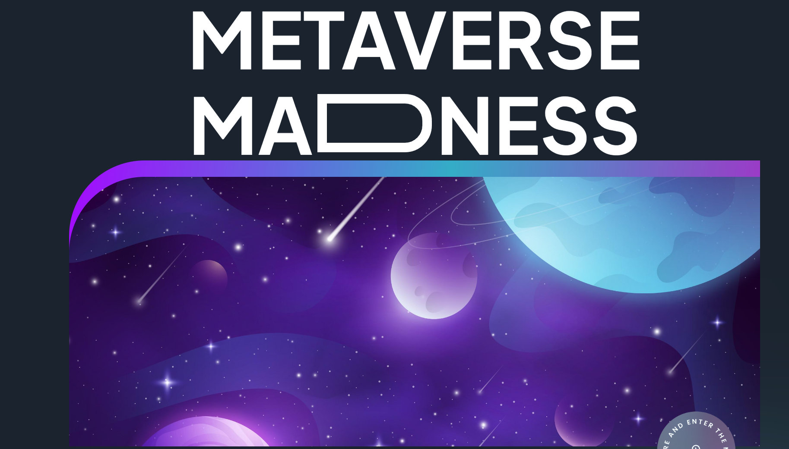

# Farmer's E-Commerce Application

Welcome to the Farmer's E-Commerce Application repository! This project is a fully working E-commerce application developed using Kotlin with real-time Firebase integration for the backend.

## Overview

This application aims to provide farmers with a user-friendly platform for buying and selling agricultural products. Leveraging the power of Kotlin and Firebase, the project offers a seamless and efficient experience for users in the agricultural community.

## Features

- **User-Friendly Interface:** Intuitive design for easy navigation.
- **Real-Time Functionality:** Utilizes Firebase for real-time updates on products and transactions.
- **Secure Transactions:** Ensures the security of user transactions and sensitive data.
- **Responsive Design:** Optimized for various screen sizes and devices.

## Screenshots

*Caption for Screenshot 1*

*Caption for Screenshot 2*

<!-- Add more screenshots with respective captions -->

## Getting Started

Follow these steps to get a copy of the project up and running on your local machine:

1. Clone the repository: `git clone https://github.com/your-username/your-repo.git](https://github.com/Axxi3/Agricultural-Ecommerce`
2. open the file in Android stuido and edit

Feel free to explore the code and contribute to making this E-commerce application even better!
